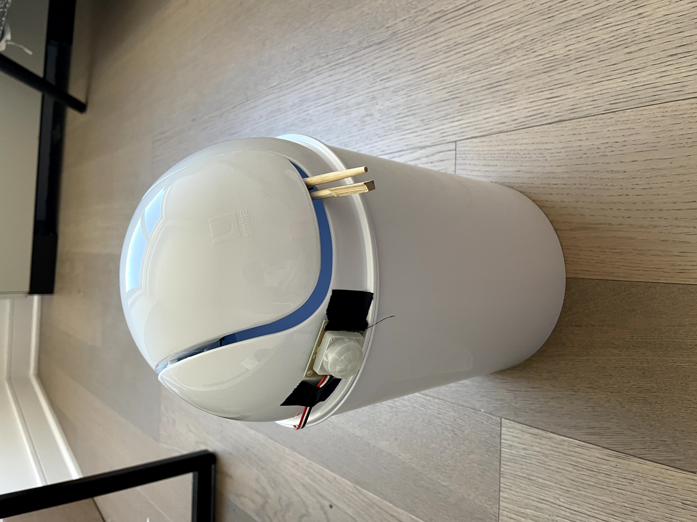

## Motivation
* I wanted to create a touchless garbage can at a relatively affordable price point since I realized a lot of the ones on the market are often $60+. I ended up getting the price point to be ~$45, but the trash can is much smaller compared to those on the market. Of course, one can use a bigger trash can at a higher price, but a more powerful servo might be required to open the lid on a bigger trash can.

## Materials ($45)

* Arduino Uno ($13)
* PIR Sensor ($10)
* Servo ($9)
* (2) 9V batteries ($3.50 each)
* Mini trash can ($5)

## Initial Paper Design

* I originally intended to have a lot of LEDs, an OLED display, and a bluetooth scale, but I didn't find these metrics to be that useful for the power they used. They also added a lot to the cost since I was trying to get this below $50.

## State Machine

### States
* closed - lid is closed, don't do anything
* open - open lid
* wait - hold for 10 seconds

### Transitions
* closed->open - PIR sensor detects movement
* open->wait - always transitions, independent of PIR sensor reading
* wait->closed - always transitions, independent of PIR sensor reading

## Schematic

## Final Outcome

### Trash can in closed state

* the stick is to intended for someone to try to grab it, and then they will be greeted with a the can opening by itself

### Trash can in open state

### Trash can lid

### Trash can bottom

## Product in Action

* [link to video version of gif](https://photos.app.goo.gl/mjFejjK8LfshSghN7)

## Reflection

* In the end, I ended up getting the project to be $45, but I still think that's too high for a garbage can. A majority of the costs came from the sensor, servo, and arduino, but at least these parts can be used in other projects. Also, I realized this servo is too weak to open a larger/heavier lid. I spent way too long trying to get this servo to open a much bigger lid on a bigger trash can (pulley system, different types of arms, different servo positions, weighted lid with pencils, etc.). During the design process, I also realized it would not be a good idea to put electronics at the base of the trash can as liquids can break the electronic components. This isn't as much of a problem if the electronics are on the lid, but I do think it would be beneficial to put a piece of cloth to cover the electronic components. Putting all of the electronics on the lid also makes it easy to change trash bags without having to maneuver around the various electronics. Also, I do think there could be a better way besides the stick/arm to indicate to a user that the trash can automatically open. Overall, this project was a lot of fun and I got to learn a lot about designing a product and bringing it to fruition.