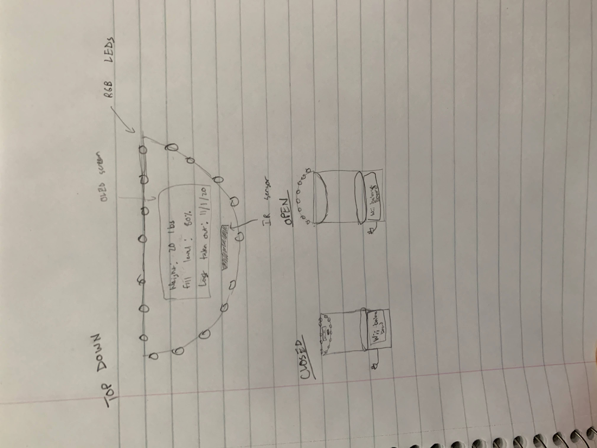

## Motivation
* I wanted to create a touchless garbage can at a relatively affordable price point since I realized a lot of the ones on the market are often $60+. I ended up getting the price point to be ~$45, but the trash can is much smaller compared to those on the market. Of course, one can use a bigger trash can at a higher price, but a more powerful servo might be required to open the lid on a bigger trash can.

## Materials ($45)

* Arduino Uno ($13)
* PIR Sensor ($10)
* Servo ($9)
* (2) 9V batteries ($3.50 each)
* Mini trash can ($5)

## Initial Paper Design

* I originally intended to have a lot of LEDs, an OLED display, and a bluetooth scale, but I didn't find these metrics to be that useful for the power they used. They also added a lot to the cost since I was trying to get this below $50.

## State Machine

### States
* closed - lid is closed, don't do anything
* open - open lid
* wait - hold for 10 seconds

### Transitions
* closed->open - PIR sensor detects movement
* open->wait - always transitions, independent of PIR sensor reading
* wait->closed - always transitions, independent of PIR sensor reading

## Schematic

## Final Outcome

### Trash can in closed state

* the stick is to intended for someone to try to grab it, and then they will be greeted with a the can opening by itself

### Trash can in open state

### Trash can lid

### Trash can bottom

## Product in Action

* [link to video version of gif](https://photos.app.goo.gl/mjFejjK8LfshSghN7)

